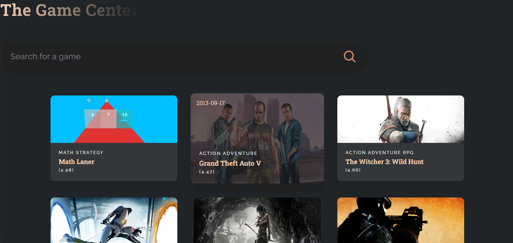
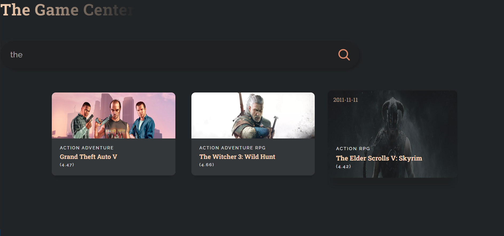

# Game Catalog

This project is a simple game catalog, where you get a structured overview of games from the RAWG game API. 

The games are shown by name along with the games cover. You can also see the rating, the release date and the genres of the game. 

Additionally, you can search for games by name by using the search bar and clicking the hourglass icon.

## Running the project

In the project directory, run:

### `npm start`

## Screenshots

### Front page

### Search page
